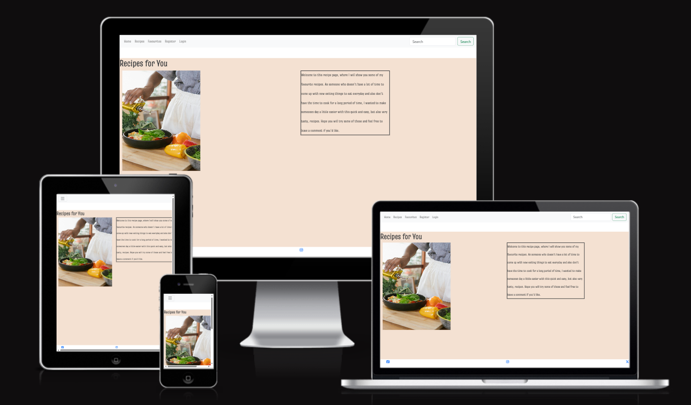
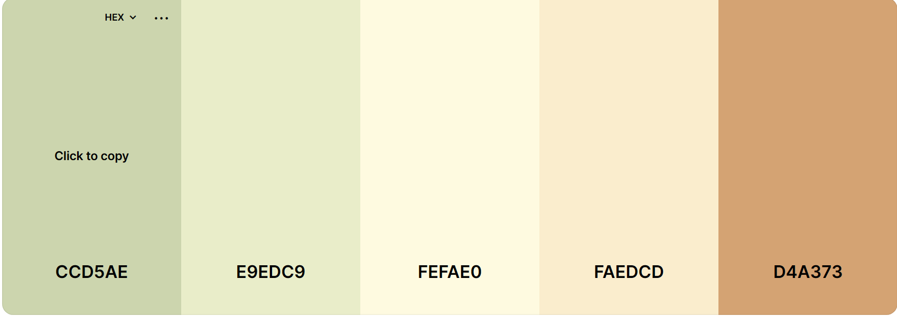
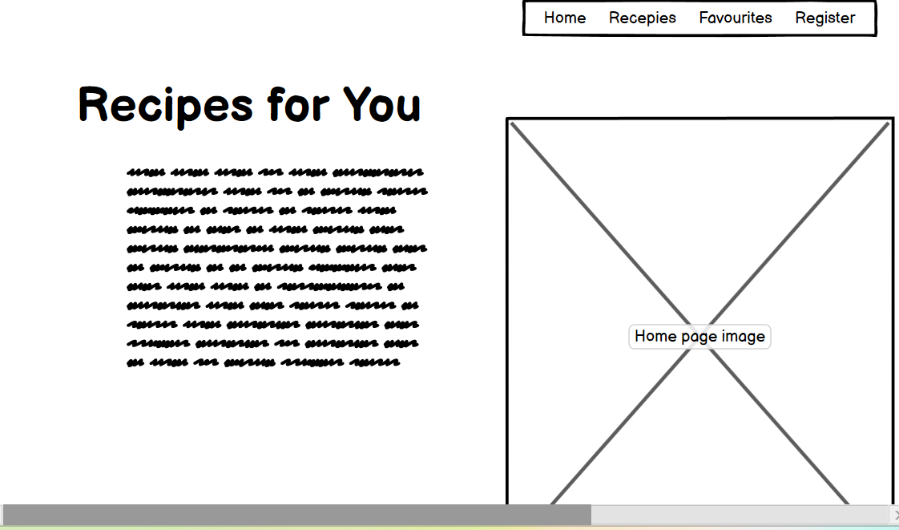
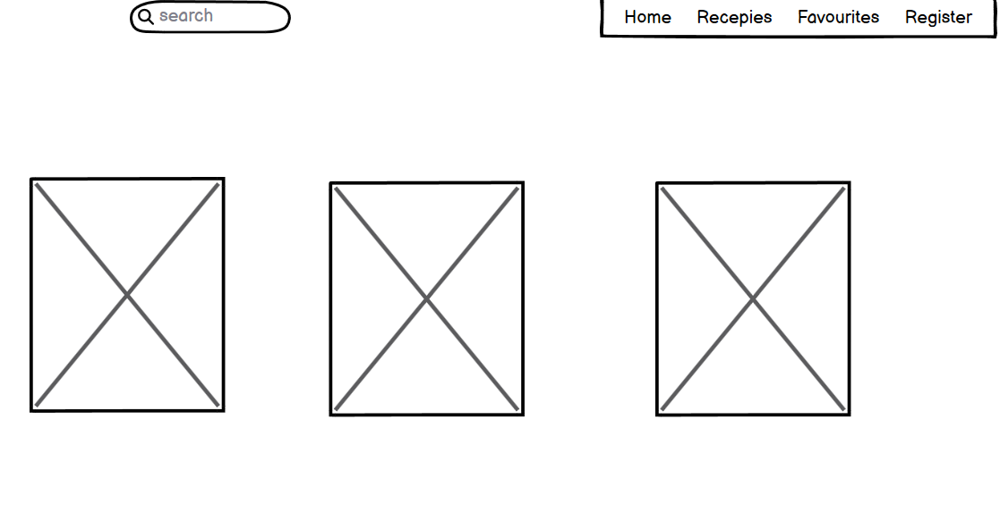
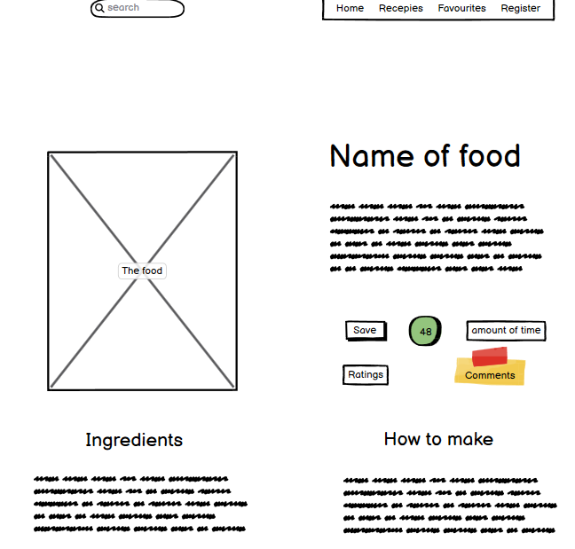
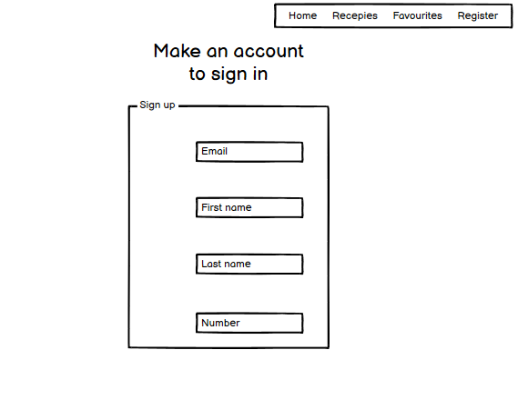

# Recipes for You

A recipe site with the goal of showing easy but fun recipes. This site will make it easy to fall in love with cooking as it has a great variety that their will definetly be something for everyone. The goal is to make a clean, easy to use website where people can find inspiration to make their day a bit easier.

## User Stories

As a visiting user...
I want to be able to see the ingredients without having to read through a bunch of text
I want to see pictures of the food
I want to be able to save the recipe to look at later
I want to be able to comment/ read comments of the recipe

As a site owner...
I want to easily post recipes
I want to be able to filter comments

## Features

The main features I want to lift are... 

The flip-cards:
With these the person will be able to see the image first, eating with their eyes so to speak, and on the other side see the ingredients. This makes it so much easier for the person to decide wether they want to make this recipe or not. If they want to continue with the recipe they will be able to click on the link to take them to that recipes page.

Login:
The visitors can register and make an account, with this they will be able to comment and save their favourite recipes.

Favourites:
The person can, if they are logged in, save the recipes they like so that they can view them later. When this page gets a lot more posts it will make it easier to find your favourite recipe and not have to search through a bunch of others. 

Comment:
The visitors will be able to comment once they're logged in. They will also be able to view what other people think. As for the site owner they can comfortably accept or not accept comments, making their page a much safer and nicer space.

## Future features

For future features it would be nice, once there are more posts, to be able to search on more general terms and get multiple recipes as suggestions. Like if someone would search 'healthy' or 'fancy dinner' they would get the appropriate result.

## Typography and Color Scheme

The typography for the posts are courier new and for the web page itself I used Truculenta from Google fonts. I wanted soft colours to reflect the calmness of the page and to chose colours I went to cooler page and looked at the different palettes there. Eventually I settled with thos one.

## Wireframes and ERD

### Wireframes

### ERD

## Bugs

The main issues I've had have been template errors, disallowed host, 404 no page found when trying to view it in the browser. Getting the paths correctly have taken a lot of my time and in hindsight I have wasted way to much time trying to understand when it has shown to not be so difficult. Ex. the disallowed host, I understood that I was supposed to add it to the allowed hosts but for some reason didn't think I could have more than the ones already there. Very silly of me.. 

Getting the tags right to show the content of the posts is a current problem I'm facing, as well as links, specifically the link to go to the recipe_detail template on the flip-cards. 

I also have yet to get to the favourites page, where people can save their favourite recipes. At first I thought I would add a boolean checkmark to the recipe_post model, but was unable to implement it as error occured when trying to save the recipe in admin. I have also in hindsight realised that, that would probobly only be available to the admin and not the user to check.

## Credits

### Media

All recipes are from [Ica](https://www.ica.se/recept/)

- Recipe 1 [Halloumi stew](https://www.ica.se/recept/halloumigryta-med-ris-725482/)

- Recipe 2 [Chorizo pasta](https://www.ica.se/recept/chorizopasta-med-oliver-729989/)

- Recipe 3 [Chicken stew](https://www.ica.se/recept/kycklinggratang-729963/)

- Recipe 4 [Pasta sallad](https://www.ica.se/recept/pastasallad-722417/)

- Recipe 5 [Grilled cheese](https://www.ica.se/recept/grilled-cheese-med-karamelliserad-lok-730019/)

- Recipe 6 [Lental soup](https://www.ica.se/recept/linssoppa-723863/)

Pictures from [Pixabay](https://pixabay.com/) and [Pexels](https://www.pexels.com/sv-se/)

Favicon for the [favicon](https://favicon.io/)

Font awesome for the social media [icons](https://fontawesome.com/)

Color palette from  [coolors](https://coolors.co/palette/ccd5ae-e9edc9-fefae0-faedcd-d4a373)

### Content

This project was built following Code institutes 'I think therfore I blog'

Bootstrap for the [navbar](https://getbootstrap.com/) 

To get some help on how to use bootstrap, Marty on [Youtube](https://www.youtube.com/watch?v=-jnCgrR_yKg)

Flip-cards from [W3schools](https://www.w3schools.com/howto/tryit.asp?filename=tryhow_css_flip_card). Also used in my [first project](https://elingrahn.github.io/Elins-Bar/)